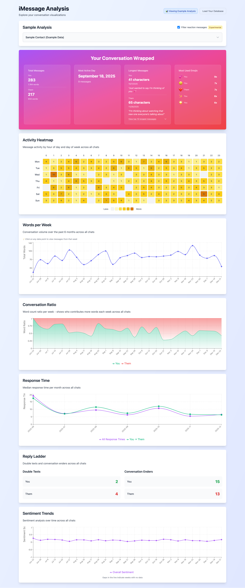

# iMessage Analysis Web App

A Next.js web application for analyzing iMessage conversations with interactive visualizations.

## Features

- **Database Upload**: Upload your `chat.db` file directly in the browser
- **Contact Selection**: Browse and select from all contacts in your database
- **Activity Heatmap**: Visualize message activity by hour of day and day of week
- **Example Analysis**: Try the tool with sample data without uploading your database

## Screenshots



*Example analysis showing the Conversation Wrapped stats, activity heatmap, and other visualizations with sample data*

## Getting Started

### Installation

1. Install dependencies:
```bash
npm install
```

2. Run the development server:
```bash
npm run dev
```

3. Open [http://localhost:3000](http://localhost:3000) in your browser

### Building for Production

```bash
npm run build
npm start
```

## Usage

1. **Upload Database**: Click "Choose chat.db file" and select your iMessage database file
   - Default location on macOS: `~/Library/Messages/chat.db`
   - Note: You may need to close the Messages app before accessing the database

2. **Select Contact**: Choose a contact from the list to analyze their conversation

3. **View Heatmap**: The activity heatmap will automatically display showing when messages are most active

## Privacy

- All processing happens **entirely in your browser**
- No data is sent to any server
- The database file is only loaded into browser memory and never uploaded anywhere

## Technical Details

- Built with Next.js 14 and React
- Uses `sql.js` for client-side SQLite database reading
- Styled with Tailwind CSS
- Fully static - no backend required

## Notes

- The database file can be large (hundreds of MB), so loading may take a moment
- Make sure to close the Messages app before trying to access `chat.db` to avoid file lock errors

## Related Documentation

For information about the Python command-line analysis tool that generates static visualizations, see [README_ANALYSIS.md](README_ANALYSIS.md).

